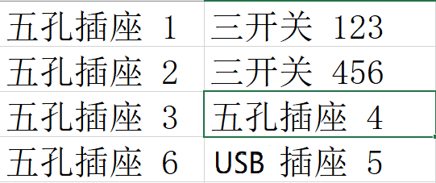

# 任务中心

## 烙铁切割塑料制作

## 整理桌面

### 所有的组件以快速拆卸的方式 方便等待房子建好迅速移动

- 文具
- 药品
- 电路板
- 

显示(小)屏 用铁丝做支架

### 备注 
- **切记保护`HGST`硬盘中的数据**

- **寻找小米手环 移动魔百盒**

 

[**制作东西时候基本全是抽屉！！！！！！！！！！！！！！！！**]()

---

## 软路由设置

- 使用爱快做好一级路由器的作用（做DHCP主路由器）
  1. USB3.0 口上网口
  2. USB2.0 口上网口做WAN 需要直通给爱快
- 使用LEDE（OPENWRT）做好插件设置，（记得了解强制使用此IP的DHCP）。

## NAS设置

-   虚拟化一个linux操作系统:omv（debian，centos）作为主系统，安装docker
-   首先做好homepage导航页
-   配置nextcloud seafiles

